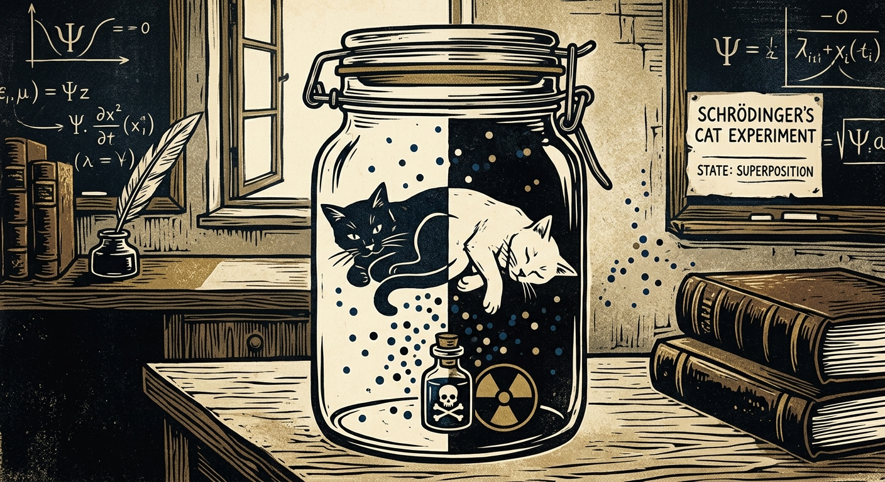

# The Poor Cat Experiments

*Quest for Entropy #14: Schrödinger's cat and Wigner's friend, demystified with a programming construct every developer uses daily.*



## The question

Last episode I introduced the Iceberg Model — the two-layer toy universe with a compute budget on top and a ledger underneath. I built it during my holidays, and I will be honest: I am a bit tired. So this part of the series starts small and granular, exactly as promised: one mystery per episode, one mechanism per mystery, with the tests behind it.

We start with the most famous mystery of them all: the poor cat.

The setup, from Schrödinger himself in 1935: put a cat in a sealed box. Add a radioactive atom, a Geiger counter, a hammer, and a vial of poison. If the atom decays, the counter clicks, the hammer falls, the poison spills. Quantum mechanics says that until somebody looks, the atom is in a superposition of decayed-and-not-decayed. So the whole chain is in superposition too — and the cat is dead and alive at the same time.

Three things before we go further.

First: please do not do this. It is cruel to pets, and as we are about to see, it would not even work.

Second, a correction worth making, because it changes the whole flavor of the story: Schrödinger did not invent the cat to celebrate quantum weirdness. He invented it to *complain* about it. He called setups like this "quite ridiculous cases" — his point was that a dead-and-alive cat is obviously absurd, so something must be missing in how we read the theory. The cat was born as a protest sign. Ninety years later we print it on T-shirts as if it were the theory's mascot.

Third: a real cat in a real box would not hold a superposition for even a moment. A cat is an enormous system — trillions of particles — and a cardboard box is not isolation. Air molecules bump the cat. Thermal photons bounce off it. Sound and background radiation pass through. Physicists call the result *decoherence*: every one of those tiny interactions counts as a look, and the superposition falls apart almost instantly. Labs do build cat-like superpositions for real — but with tiny systems, near absolute zero, behind heroic shielding. That is the whole reason quantum computers cost billions and are still brutally hard to scale: the entire engineering problem is keeping superpositions isolated from a universe that constantly wants to look.

Remember this isolation point. It is not a footnote. It is a clue, and we will come back to it.

## The toy

Here is the bet of this whole series: what if the universe is a big asynchronous distributed system, and we are processes inside it? That is what the Iceberg paper postulates. And frankly, the opposite would be the shocking option — a single-threaded universe, one global queue, everything everywhere processed synchronously in lockstep. Distribution and asynchrony are not exotic assumptions. They are what every large system we have ever built looks like.

So let's take asynchrony seriously and ask what an observer *inside* such a system sees.

Software already has the exact construct we need. It has a fancy pedigree — functional programming, category theory, the word *monad* gets used — but every working developer meets it in plain clothes as **futures or promises**. I will use JavaScript promises.

When you construct a promise, you hand the runtime a piece of code to run. What you get back is not a value. It is a *promise of a value* — a handle to a computation whose result does not exist for you yet. If you want the value, you `await` it. From the moment of construction to the moment of `await`, your world has split into two independent tracks — the main track and the experiment track — with a common history and isolated presents.

Here is the cat, in eleven lines:

```js
const experiment = new Promise((resolve) => {
  // the sealed box: the runtime decides when this actually runs
  setTimeout(() => {
    const decayed = Math.random() < 0.5;   // the unstable atom
    resolve(decayed ? "dead" : "alive");   // the vial breaks, or not
    // (in the Iceberg: resolve = settlement, a co-signed record in the hidden ledger)
  }, Math.random() * 1000);
});

// ... the examiner's thread goes on with its day; the box stays closed ...

const cat = await experiment;              // opening the box
console.log("the cat is " + cat);
```

You can paste this into your browser's console. It runs.

Now, where is the mystery? Two concurrent tracks — so what? Here is the thing: *the interleaving is not controlled by the threads.* The runtime, the operating system, the scheduler decide when each piece actually executes, and nobody inside a thread can see the schedule. Maybe the experiment ran to completion before the examiner's next line. Maybe it has not even started, and will only be scheduled at the last possible moment. Both are legal. Both happen in practice.

And from inside the examiner's track, there is no way to ask. JavaScript gives you no synchronous way to peek at a pending promise — no `experiment.isDoneYet()`, no reading the value without `await`. That is not a safety rule bolted on top. It is the shape of the language: the value simply is not part of your track until the synchronization point.

So from the examiner's perspective, until the `await`, both outcomes are genuinely open. And at the `await`, the result "happens" instantly — even if the runtime must, at that exact moment, finally schedule the experiment code and finish it. The value arrives exactly when you look. Not because looking is magic. Because looking *is* the synchronization point.

That is the cat. The sealed box is a `Future<Cat>` — an unresolved promise. Opening the box is the `await`. Asking "but is the cat *really* alive right now?" is asking for a field of an unresolved future: a type error, not a mystery.

One construction note, and it matters: promises are only the top half of this story. In a runtime, a pending value lives in the engine's private memory. In the Iceberg Model it lives one layer down — under the waterline, in the hidden ledger, as a *contract* between the atom and whatever it touches. The threads on the visible layer hold only handles. And what resolves the fork is not the runtime's mood: it is *settlement* — a co-signed record appended in the hidden layer. That is the extra mechanism the model builds on top of the futures picture, and it is literally how the iceberg was constructed: futures above the waterline, settlement below. Keep both halves in hand. The cat only needs the top one; Wigner, below, will need the bottom.

And one honest difference between the toy and the model, because it is the doctrine this whole programme runs on: promises do not *touch*. In the runtime, `await` is a free read — a pure synchronization point. The examiner receives the value without disturbing the experiment in any way; a thousand threads could await the same promise, and the experiment would never know. [Episode #11](https://questforentropy.substack.com/p/the-observer-that-had-to-touch) was about discovering — slowly, and the hard way — that the universe refuses exactly this: there are no free reads in physics. Watching is throwing photons. Every look is an interaction. In the Iceberg the two ideas become one: the *only* way to synchronize with the box is to co-sign a record with it. The synchronization point and the touch are the same event, and its name is settlement. The promise gives you the waiting; the ledger makes the waiting end in a handshake instead of a peek.

And the isolation clue pays off. In the computer, isolation is perfect and free — the promise is sealed by construction, and peeking is not even expressible. In physics, isolation is the *expensive* part: every stray photon is a peek, every air molecule opens the box a little. The computer gives us the idealized version of the experiment that nature makes almost impossible to build. That is why the cat paradox feels so wrong in a kitchen and reads so plainly in a runtime.

## The run

This episode does not need a new machine — the machine from episode #13 already sat these exams. The rows behind this story, from the Solaris 1.0.0 battery:

- **The box settles itself.** A silent detector — one that does *not* click — still settles the atom's fork (QM-22). No human needed: measurement is any co-signed interaction, and a cat co-signs thousands of records a second. The outcome settles at the first interaction inside the box; the cat is a participant, not a bystander.
- **Fragility is measured.** Each record leaked to the environment cuts the fork's visibility by a measured product law, and undoing a settled outcome costs chasing down every replica (QX-4, QM-4, QM-9). That is the toy's version of decoherence — and of why the poor cat could never stay both.
- **Peeking is physical.** A watcher who has not interacted gains nothing: no joint record, no information, interference intact (QM-29). Looking is not a mental act; it is a transaction.
- **There is no global photograph.** The freeze-everything-at-once snapshot of the system provably does not exist; there are only "as of" cuts through the ledger (SUB-19). Keep this one in hand — it is about to carry the next section.

## Wigner's friend, or two books that cannot disagree

Now the harder experiment — same poor cat, one more level of nesting. In 1961 Eugene Wigner asked: what if the *scientist* is in the box?

Put your friend in a sealed laboratory with the whole cat setup. The friend opens the box, sees the outcome, writes it in a notebook. For the friend, the matter is settled — a definite fact, recorded. But Wigner stands *outside* the sealed lab. And by the same quantum rules he applies to any isolated system, he must describe the entire lab — friend, notebook, cat and all — as a superposition of "friend saw dead" and "friend saw alive."

So did the outcome happen or not? For the friend it is a fact. For Wigner it is not yet. Modern versions of this puzzle (Frauchiger and Renner sharpened it into a theorem in 2018, and it has since been probed in real photon experiments) make the tension precise: quantum theory cannot keep facts absolute, observer-independent, and universal all at once. Something has to give.

Here is what I find funny as an engineer: distributed systems gave that up decades ago, and nobody mourned. Ask any banking system "what is the account balance, *really*, right now?" and it will answer: at which branch, as of which sync? A transaction committed at one branch office is real *there* — durably, irreversibly — and simply not yet a fact at a branch that has not synced. Nobody calls this a paradox. It is Tuesday.

The Iceberg Model runs the Wigner setup on exactly that machinery — this is where the ledger from episode #13 earns its keep. In the model, a fact is a record co-signed by the parties involved and appended to their local chains. Measurement is settlement. And facts are *relative until reconciled*. Step by step:

1. The friend measures: friend and atom co-sign, and a block lands on the friend's chain. Settled. Irreversible for the friend — records do not un-write.
2. Wigner has co-signed nothing. His view of the lab is a still-pending fork — and this is *correct*, not ignorant. His cut through the ledger genuinely contains no settlement. Both descriptions are right, because they are different "as of" cuts of the same append-only history.
3. Opening the lab is not "finding out." It is an interaction — a co-signature between Wigner and the lab. Merging the books.
4. And here is the theorem the toy actually measures: on merging, Wigner's own measurement agrees with the friend's recorded outcome — 2,000 runs out of 2,000 (QM-8). Not luck, and not a coincidence to check for: the *only* way to ask "friend, what did you see?" is to interact, and the interaction is itself a settlement on the same shared contract. Comparing IS reconciling. A contradiction has no mechanism by which to appear.

"So when did the collapse *really* happen?" is the auditor's question from last episode — a question addressed to the head office. There is no head office. There are two books, each honestly kept, and a guarantee that the moment they meet, they are one book.

In promise language, Wigner holds a promise of the entire lab, with the friend's `await` nested inside it:

```js
const lab = new Promise(async (resolve) => {
  const cat = await experiment;                  // the friend opens the box - settled in here
  resolve({ cat, note: "I saw it: " + cat });    // but nothing has left the lab yet
});

// Wigner, outside: friend, notebook and all - one big pending value
const { cat, note } = await lab;                 // opening the lab: the ledgers merge
// note always agrees with cat. Always.
```

Inside the lab-promise, the result is resolved, logged, done. Outside, the whole lab is one pending value. Two isolated tracks, a common history, and a reconciliation that cannot disagree with itself.

## The Confession

Every episode confesses. This one has three items.

**A promise is not a quantum state — but be careful *why*.** The cheap objection is "the promise's outcome was secretly decided all along, so its superposition is fake." Not quite — look at the snippet's timeline. Before the timer fires, the boolean does not exist *anywhere* — not hidden, not encrypted; the machine simply has not produced it yet. Only between the firing and the `await` is the value "decided but unread" — and from inside the examiner's thread, the two phases are indistinguishable. So a pending promise is genuinely unsettled *for its observer*; on that point the analogy holds. The honest gap is the *type* of the pending value. A promise pends toward a scalar — one plain boolean. A quantum fork pends toward a *wave*: a single object whose two branches are live components carrying amplitudes — and amplitudes can *cancel*. That cancellation, interference, is measurable, and it is nature's own box-certification instrument: run many identical boxes, and if each held a hidden decided boolean, the statistics could only mix — never cancel. Whatever waits inside is more than a hidden boolean. Note what superposition is *not*, on this reading: not "the cat is in both states at once," and not two computations racing in parallel — it is one definite object with two live components, which is a third thing our language does not have a good word for. This is also where quantum computing honestly lives: not "trying every answer at the same time" (a myth), but steering one rich object so the wrong branches cancel — closer to how a soap film computes the shortest road network between pins by relaxing as a single physical body than to a data center of threads. Promises make web pages, not qubits. And in the Iceberg Model the amplitudes and their interference are *imported, not explained* — episode #13's deepest confession, still standing.

**`Math.random()` is a stand-in.** In the model there are no dice: a settlement's outcome is fed deterministically from the measuring node's own chain history — unpredictable from inside for the same reason hashes are. The toy's full quantum battery passes with every random draw replaced by chain-fed hashes. In the snippet I used the honest JavaScript equivalent of not caring.

**One box tells you nothing about pairs.** A skeptic will say: "so the outcome was set all along — you just dressed up ignorance." Careful: set *where*? Before the timer fires, the value exists nowhere (see the first item), and in a distributed system "decided" is not even a well-formed word until you say *on whose ledger* — from the examiner's track, the fork is genuinely open. What I do concede: for a single box, a decided-all-along story can still be told consistently; nothing in one box alone refutes it. The famous killer of such stories lives in *pairs* of boxes measured at chosen angles — Bell's theorem — and this episode deliberately does not touch it. The model faces Bell head-on with its shared-contract mechanism and measured CHSH rows, and that story gets its own episode: spooky action at a distance.

## What this does NOT claim

> This episode demonstrates that "both outcomes until observed" and "facts that differ between observers" have mundane, working mechanisms in asynchronous computation — in a code snippet you can paste into a console, and in a toy model with measured test rows. It is not a claim about how nature actually works. Promises alone are not the model, either: they carry the asynchrony half, and the Iceberg completes them with the hidden settlement layer where the state actually lives. The promise analogy carries no quantum-computing claim: promises hold classical values and do not interfere, and interference is exactly the quantum content the Iceberg Model imports rather than explains. Bell-type correlations between *pairs* are out of this episode's scope entirely. All numbers were produced with AI assistance and are under continuing verification — which is why everything reproduces with one command.

## The neighbors

The cat is Schrödinger's (1935, as a protest); the friend is Wigner's (1961). Decoherence — Zeh and Zurek — is mainstream physics' own answer to why a cat cannot hold a fork, and Zurek's *quantum Darwinism* (a fact becomes objective by being copied into many environmental fragments) is the closest physics cousin of the ledger's consensus-by-replication row. Rovelli's relational quantum mechanics has long argued that facts are relative to observers — the nearest philosophical neighbor of "relative until reconciled" — and the consistent-histories school reads quantum theory through exactly the kind of "as of" cuts used here. Frauchiger–Renner (2018) and the photonic tests that followed sharpened Wigner's puzzle into a no-go theorem; the model gives up precisely the assumption those theorems put under pressure — absolute, observer-independent facts — and adds the reconciliation guarantee that keeps all observers agreeing whenever they actually meet. What is ours here is small: the promise/ledger dictionary, and a measured row behind each sentence.

## Run it yourself

Two levels. The snippets above run as-is — paste them into any browser console and torment a purely virtual cat. The measured claims live in the model repository: [github.com/questforentropy/iceberg-model](https://github.com/questforentropy/iceberg-model) — one command: `python labs/run_exams.py all --record solaris-1.0.0 --expect-red GR-34,GR-35,GR-36`. This episode's rows: QM-22 (silent detector settles), QX-4/QM-4/QM-9 (fragility and replication), QM-29 (no co-signature, no information), SUB-19 (no global snapshot), QM-8 (Wigner agreement, 2000/2000). Archived: DOI [10.5281/zenodo.22046196](https://doi.org/10.5281/zenodo.22046196).

## How this was made

I'm a software architect. I built an adversarial research harness around AI agents and ran a physics toy-model programme through it; this piece reports a part that survived. The direction, the concepts, the questions and the accept/reject calls are mine; AI systems (Anthropic's Claude Fable, Opus and Sonnet, plus DeepSeek) executed the experiments from frozen, pre-declared specifications and wrote the text — this article included — from my guidance and under my editing. Every number is code-generated and reproducible from the repository above. A public honesty ledger records every commissioning error the process caught.

## Next time

One closing thought. Everything in this episode came from two tracks and one synchronization point — the simplest asynchronous setup that can be built, and not even a distributed system: one machine, one runtime, no network. Even that was enough to keep "is the cat alive?" without an honest answer for ninety years. Real distributed systems are famously harder to reason about; the engineers who run them get paged at night by behaviours nobody predicted, in systems nowhere near as large or as powerful as the universe. Scale that intuition up, and the quantum weirdness stops being surprising. The surprise would be its absence.

Next time, the most popular mystery object of them all: the black hole. In the Iceberg it is a region so crowded with records that the grid slows toward a stop — a traffic jam in spacetime, with no singularity anywhere. It comes with the series' best confession yet: three tests that fail on purpose, and stay red. I will bring pictures.

---

*Quest for Entropy is written by Marijus Masteika. Entropy was always the dark horse for me — connected to information, and maybe hiding answers to everything. That's the quest.*
